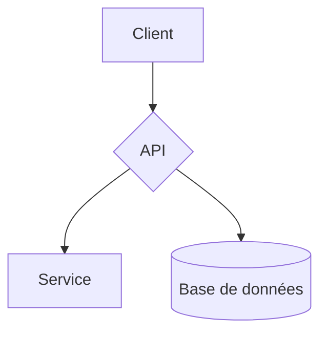

# X23 Doc Generator

Générez un **site de documentation autonome** (HTML mono-fichier) et un **PDF soigné** à partir de simples fichiers Markdown — directement dans le navigateur, sans serveur, sans installation, sans build.

Un seul fichier `generator.html`. Vous l'ouvrez, vous glissez vos `.md`, vous téléchargez votre documentation. C'est tout.

> Un produit [X23 SYSTEMS](https://github.com/x23-systems) · Open Source

---

## Sommaire

- [Pourquoi cet outil](#pourquoi-cet-outil)
- [Fonctionnalités](#fonctionnalités)
- [Démarrage rapide](#démarrage-rapide)
- [Comment ça marche](#comment-ça-marche)
- [Organiser ses fichiers Markdown](#organiser-ses-fichiers-markdown)
- [Markdown pris en charge](#markdown-pris-en-charge)
- [Diagrammes Mermaid](#diagrammes-mermaid)
- [Export PDF](#export-pdf)
- [Marque blanche](#marque-blanche)
- [Configuration](#configuration)
- [Déploiement](#déploiement)
- [Confidentialité](#confidentialité)
- [Dépendances](#dépendances)
- [Compatibilité](#compatibilité)
- [Limitations connues](#limitations-connues)
- [Contribuer](#contribuer)
- [Licence](#licence)

---

## Pourquoi cet outil

La plupart des générateurs de documentation (Docusaurus, MkDocs, etc.) imposent une toolchain : Node, Python, un build, un serveur, un déploiement. Pour partager une doc rapidement — un guide client, une note d'architecture, un manuel interne — c'est souvent trop.

X23 Doc Generator part de l'inverse : **zéro dépendance à installer**. Tout tient dans un fichier HTML qui s'exécute dans n'importe quel navigateur moderne. Le résultat est lui aussi un **fichier unique**, que l'on peut envoyer par e-mail, déposer sur un partage réseau, ou ouvrir hors-ligne en double-cliquant.

## Fonctionnalités

- **Mono-fichier, sans serveur** — un seul `generator.html`, aucune installation, aucun build.
- **Import souple** — glisser-déposer, sélection de fichiers, ou import d'un dossier complet (`.md` / `.markdown`).
- **Site HTML autonome** — le fichier généré embarque tout le contenu et fonctionne **hors-ligne** depuis `file://`, sans les `.md` d'origine.
- **Navigation complète** — menu latéral, recherche plein texte, sommaire de page (TOC), fil d'Ariane, liens internes résolus, page d'erreur intégrée, copie de lien.
- **Détection des liens cassés** avant génération.
- **Export PDF** composé dans le navigateur (texte vectoriel sélectionnable) avec **page de garde**, **sommaire paginé automatique** et pieds de page numérotés.
- **Diagrammes Mermaid** rendus dans le site HTML **et** dans le PDF.
- **Marque blanche** — les documents produits ne portent aucune marque de l'outil.
- **Responsive** — sidebar repliable sur mobile.
- **Confidentiel** — vos fichiers ne quittent jamais le navigateur.

## Démarrage rapide

**Option A — En local (le plus simple)**

1. Téléchargez [`generator.html`](generator.html).
2. Ouvrez-le dans votre navigateur (double-clic).
3. Glissez vos fichiers `.md`, suivez les 3 étapes, téléchargez votre site HTML ou votre PDF.

**Option B — Cloner le dépôt**

```bash
git clone https://github.com/x23-systems/x23-doc-generator.git
cd x23-doc-generator
# ouvrez generator.html dans votre navigateur
```

Aucune commande d'installation, aucune dépendance npm : il n'y a rien à compiler.

## Comment ça marche

Le générateur se déroule en trois étapes :

1. **Import** — Ajoutez vos fichiers Markdown (glisser-déposer, fichiers, ou dossier). Un aperçu de chaque page est disponible. Si un `index.md` est présent, il est détecté automatiquement ; sinon vous choisissez la page d'accueil.
2. **Vérification** — Le générateur liste les pages détectées, compte les liens internes et **signale les liens cassés** (cibles non importées) avant de générer.
3. **Génération** — Choisissez un titre, puis téléchargez :
   - **HTML** : un fichier `documentation.html` autonome ;
   - **PDF** : un fichier `documentation.pdf` composé à la volée.

## Organiser ses fichiers Markdown

Le **menu de navigation** du site généré est construit à partir des liens présents dans votre `index.md`. C'est la façon recommandée de contrôler l'ordre et les libellés du menu :

```markdown
# Mon projet

- [Introduction](introduction.md)
- [Installation](guide/installation.md)
- [Architecture](architecture/index.md)
- [FAQ](faq.md)
```

Si aucun `index.md` n'est fourni, le menu est généré automatiquement à partir des fichiers importés.

**Liens internes.** Utilisez des liens Markdown classiques, relatifs au fichier courant. Ils sont résolus automatiquement dans le site généré :

```markdown
Voir le [guide d'installation](guide/installation.md) ou revenir à l'[accueil](../index.md).
Lien vers une section précise : [la configuration](guide/installation.md#configuration).
```

Les chemins relatifs (`./`, `../`), les ancres (`#section`) et les extensions `.html` (converties en `.md`) sont gérés. Les liens externes (`https://…`) s'ouvrent dans un nouvel onglet.

## Markdown pris en charge

Titres, paragraphes, **gras**, *italique*, `code inline`, ~~barré~~, liens, images, listes à puces et numérotées (imbriquées), citations, filets de séparation, blocs de code (avec coloration via les classes de langage), tableaux avec alignement, et diagrammes Mermaid.

Le rendu utilise [marked](https://marked.js.org/) lorsqu'il est disponible, avec un **analyseur de secours intégré** : si le CDN est inaccessible, le Markdown reste correctement rendu hors-ligne.

Le sommaire de page (TOC) est généré à partir des titres `H2` et `H3` et s'affiche dès qu'une page contient au moins deux titres.

## Diagrammes Mermaid

Insérez un bloc de code avec le langage `mermaid` :

````markdown

````

Le diagramme est rendu en image dans le site HTML et dans le PDF.

- Dans le **site HTML**, le diagramme est rendu en SVG.
- Dans le **PDF**, il est rasterisé en image haute résolution (×3) pour un rendu net et fiable.
- **Hors-ligne** (CDN Mermaid indisponible), le bloc retombe proprement sur un bloc de code étiqueté « Mermaid ».

## Export PDF

Le PDF n'est **pas** une capture d'écran ni une impression : il est **composé dans le navigateur** avec [pdfmake](http://pdfmake.org/), puis bufferisé et téléchargé. Vous obtenez :

- du **texte vectoriel sélectionnable** (pas une image floue) ;
- une **page de garde** (titre + date) ;
- un **sommaire paginé automatiquement**, avec les numéros de page résolus ;
- un **saut de page par document** et des **pieds de page numérotés** ;
- les **diagrammes Mermaid** intégrés en image nette.

> La police du PDF est Roboto (police par défaut de pdfmake). L'export PDF charge pdfmake depuis un CDN au premier clic : **une connexion internet est requise pour le PDF**. L'export HTML, lui, fonctionne entièrement hors-ligne.

## Marque blanche

Les documents produits — site HTML **et** PDF — sont **neutres** : ils ne contiennent aucune référence à l'outil ni à son éditeur. Seul le **titre de votre documentation** apparaît. Vous pouvez donc distribuer la doc générée sous votre propre marque, sans retouche.

## Configuration

Une seule constante est à personnaliser, en haut du bloc de script de `generator.html` :

```js
/* ⚙️  À MODIFIER : URL de votre dépôt GitHub (bouton ⭐ de l'outil) */
var X23_REPO_URL = "https://github.com/x23-systems/x23-doc-generator";
```

Elle alimente le bouton « Star » et le lien du dépôt **dans l'interface du générateur** (pas dans les documents générés, qui restent en marque blanche).

## Déploiement

`generator.html` est un fichier statique : hébergez-le où vous voulez.

**GitHub Pages**

1. Dans le dépôt : *Settings → Pages*.
2. Source : branche `main`, dossier `/ (root)`.
3. L'outil sera accessible à `https://<compte>.github.io/x23-doc-generator/generator.html`.

Il fonctionne aussi parfaitement servi depuis n'importe quel hébergement statique (OVH, Netlify, S3…) ou ouvert localement en `file://`.

## Confidentialité

Tout se passe **côté navigateur**. Les fichiers Markdown sont lus localement via l'API `FileReader` ; **aucun contenu n'est envoyé sur un serveur**. Les seules requêtes réseau concernent le chargement des librairies de rendu depuis leur CDN (Markdown, Mermaid, PDF). Aucune donnée de vos documents n'est transmise.

## Dépendances

Chargées à la demande depuis un CDN, aucune n'est à installer :

| Librairie | Rôle | Chargement |
|---|---|---|
| [marked](https://marked.js.org/) | Rendu Markdown | Au démarrage (avec analyseur de secours intégré) |
| [Mermaid](https://mermaid.js.org/) | Diagrammes | Au démarrage (repli hors-ligne) |
| [pdfmake](http://pdfmake.org/) | Composition PDF | Au premier export PDF |
| [IBM Plex Sans / Mono](https://www.ibm.com/plex/) | Typographie | Au démarrage (repli sur police système) |

L'export HTML fonctionne hors-ligne ; Mermaid, les polices web et l'export PDF nécessitent une connexion (CDN), avec un repli gracieux à chaque fois.

## Compatibilité

Fonctionne sur les navigateurs modernes : Chrome / Edge, Firefox, Safari. L'**import de dossier** (`webkitdirectory`) est mieux pris en charge sur les navigateurs basés sur Chromium.

## Limitations connues

- L'export PDF et le rendu Mermaid requièrent une connexion internet (CDN).
- Le PDF utilise la police Roboto (par défaut de pdfmake) ; l'intégration d'une police personnalisée nécessiterait de l'embarquer.
- Les **images** référencées par URL ou chemin relatif ne sont pas embarquées dans le PDF (elles sont remplacées par un libellé) ; privilégiez les diagrammes Mermaid pour les schémas.
- Le site HTML généré embarque l'intégralité du contenu : pour des documentations très volumineuses, le fichier peut devenir lourd.

## Contribuer

Les contributions sont les bienvenues. Le projet tenant dans un seul fichier, le plus simple est :

1. *Fork* du dépôt.
2. Modification de `generator.html`.
3. Test en ouvrant le fichier dans un navigateur.
4. *Pull request* décrivant le changement.

Pour les bugs et suggestions, ouvrez une *issue*.

## Licence

Distribué sous licence **MIT**. Voir le fichier [`LICENSE`](LICENSE).

---

<p align="center">Fait avec soin par <strong>X23 SYSTEMS</strong> · Si l'outil vous est utile, pensez à ⭐ le dépôt.</p>
